# 1  引言
**硬件工程 嘉立创工程路径：** 
	直流电机控制器/IFR_DCMotorCtrler/PendulumDriveBoard_V2.4_260624

**固件工程 Github 仓库地址：**
	[YiChenHai7296/Pendulum_Microcontroller: 用于软尺摆/倒立摆项目，单片机代码版本管理](https://github.com/YiChenHai7296/Pendulum_Microcontroller)

| 文档版本号 | 对应软件版本号 | 对应硬件版本号 | 修改人            | 日期     | 修改点   |
| ----- | --------- | --------- |  -------------- | ------ | ----- |
| V1.0  | V2.0      |  V2.4     | YiChenHai(xyf) | 260609 | 创建文档。 |

## 1.1  编写目的
本文档描述软尺摆/倒立摆通用驱动控制板，硬件工程 `PendulumDriveBoard`(V2.4)、固件工程 `PendulumDriveFW`(V2.0）的系统总体方案，旨在：

- 将 §2 所述上位机通信、电机控制、数据采集等功能需求，分别落实为可实现的硬件电路架构（§3）与嵌入式软件设计（§4）；
- 说明板卡供电分区、主控与外设接口、电机驱动与模拟采样等硬件要点，为固件外设分配、时序配置及换算提供依据；
- 说明四层软件架构、工程目录、运行流程及各层模块职责，明确硬件平台之上的软件实现路径；
- 汇总可测试性设计与遗留问题，为开发、联调、维护、评审及后续扩展提供统一的设计依据与参照。

本文档面向硬件设计、嵌入式软件开发、测试联调，供项目技术人员使用。

## 1.2  背景简述
本系统为软尺摆控制教学设备和倒立摆控制教学设备的通用驱动控制板，为下图中的蓝色标红部分。
PC机上通过运行上位机程序，将控制指令发下至驱动控制板，由驱动控制板直接控制实际的控制对象，完成控制算法的调参和验证。
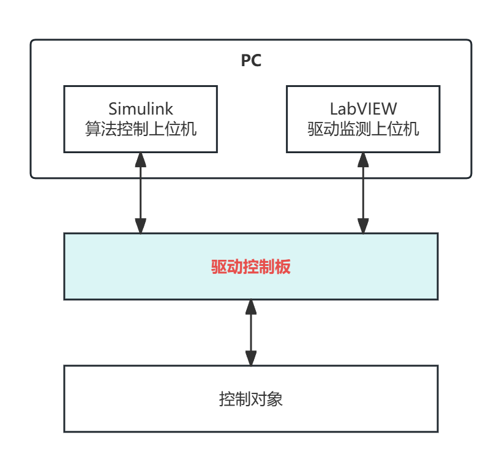
## 1.3  参考资料
- 《rm0440-stm32g4-series-advanced-armbased-32bit-mcus-stmicroelectronics》
- 《单片机裸机系统编码规范V1.2》
- 《eCoder编码器用户手册V2.4》
- 《Grounding in mixed-signal systems demystified》
- 《Op Amp PCB Layout – Mixed Signals, Grounding & Bypass Capacitors》

## 1.4  缩略语

| 缩略语/术语       | 英文或原文                           | 含义            | 文档/工程中的用                                  |
| ------------ | ------------------------------- | ------------- | ----------------------------------------- |
| CubeMX       | —                               | ST 外设配置工具     | 生成 HAL 初始化代码                              |
| HSE          | High Speed External oscillator  | 外部高速晶振        | `PF0/PF1` 接 24 MHz，系统主时钟源（§3.3.2）         |
| H 桥          | H-Bridge                        | 全桥功率开关拓扑      | `DRV8701` 预驱 + `Q1～Q4` MOSFET 驱动电机（§3.4）  |
| RS485        | —                               | 差分串行总线标准      | 三路编码器经 `SP3485` 转 RS485（§3.3.3）           |
| RS232        | —                               | 单端串行接口标准      | Simulink 上位机经 `SN75C3232` 转 RS232（§3.3.3） |
| DE/RE#       | Driver Enable / Receiver Enable | RS485 收发方向控制  | MCU GPIO 控制 `SP3485` 半双工收发（§3.3.3、§3.6）   |
| SWD          | Serial Wire Debug               | 两线调试接口        | `PA13/PA14` 接 `CN2`，烧录与在线调试（§3.3.2、§3.6）  |
| TC           | Transfer Complete               | DMA 传输完成标志    | 编码器收帧与 IDLE 联合处理                          |
| UEV          | Update Event                    | 定时器更新事件       | TIM1 1 ms 周期，触发电机编码器                      |
| IDLE / 空闲线中断 | UART IDLE Interrupt             | 一帧字节流结束检测     | USART2 控制帧入队；编码器应答组帧                      |
| TRGO         | Trigger Output                  | 定时器触发输出       | HRTIM TimerA 输出，触发 ADC 采样                 |
| SysTick      | System Tick                     | 系统时基          | 最低中断优先级                                   |
| 影子寄存器        | Shadow Register                 | 下一周期生效的比较值    | TimerB 偶数周期写入新 PWM 占空比                    |
| CRC          | Cyclic Redundancy Check         | 循环冗余校验        | 控制帧/反馈帧及编码器应答帧校验                          |
| 序列锁          | Sequence Lock                   | 奇偶序列号读写保护     | 防止编码器多字节数据被中断撕裂                           |
| HAL          | Hardware Abstraction Layer      | 硬件抽象层         | CubeMX 生成，面向 STM32 外设                     |
| BSP          | Board Support Package           | 板级支持包         | 板级初始化及平台相关功能                              |
| CM           | Command/Message                 | 编码器帧头标识字节     | 期望 0x02                                   |
| SA           | Status/Address                  | 编码器状态域        | 含计数错误、多圈/电池错误位                            |
| AS0~AS2      | Absolute Status bytes           | 绝对位置数据域（3 字节） | 与 CM、CRC8 共 6 字节/帧                        |


# 2  系统需求描述
## 2.1  原始需求描述
对于通用驱动控制板，原始需求主要为以下三方面：
- **上位机通信**：
	- 支持两路串口的上位机PC通信，波特率设置为**921600**；
	- 应答模式，接收一帧控制帧，回复一帧反馈帧。
- **电机控制**：
	- 支持使能选择、方向选择和转速控制；
	- 支持**万分之一**的转速调节精度；
	- 规定PWM波形输出周期为**50us**。
- **数据采集**：
	- 支持电机工作电流采集，采样点应在PWM高电平和低电平中心点，采集**误差应<10mA**；
	- 支持电机位置反馈、输出轴位置反馈、摆杆位置反馈；
	- 支持软尺振幅数据反馈，采集**误差应<10mV**。

## 2.2  功能需求整理
- **上位机通信**：
	- 此部分占用两路串口，用于指令接收和反馈发送；
	- 应使用环形缓冲区，设置一定深度，保障接收的控制帧均被响应，无丢帧。
- **电机控制**：
	- 板载电路应包含H桥及其驱动电路；
	- 万分之一的转速调节精度，应使用HRTIM进行pwm输出。
- **数据采集**：
	- 电机工作电流，需区分高电平点和低电平点，占用两路adc采集；
	- 电机位置反馈、输出轴位置反馈、摆杆位置反馈应使用三个独立的绝对值编码器，占用三路串口资源；
	- 软尺振幅数据，可选电压采集传感器，占用一路adc采集；
	- 此部分数据按需求保留最新一帧或多帧。

# 3  系统硬件设计

## 3.1  本章说明与需求映射
本章描述软尺摆/倒立摆通用驱动控制板（工程 `PendulumDriveBoard`）的硬件总体方案，说明板卡如何将 §2 中的功能与精度需求落实为可实现的电路架构，并为 §4 软件设计中的外设分配、采样换算与时序配置提供硬件依据。
 
**本章范围：**
1. 需求对应关系，硬件总览(原理图、PCB_3D图)；
2. 供电域说明(功率域 P 域 / 控制域 S 域)及接地策略；
3. 主控选型、时钟调试、通信接口与电机控制信号链路；
4. 电机驱动拓扑(预驱 + 外置 H 桥)及开关特性；
5. 电机电流与软尺摆幅两路模拟采样说明；
6. 主控引脚工程速查表。

### 3.1.1  与系统需求的对应关系

| §2 需求要点                 | 硬件实现                                                                                                             | 详见        |
| ----------------------- | ---------------------------------------------------------------------------------------------------------------- | --------- |
| 两路上位机串口通信，波特率 921600    | `USART2` ttl经 `SN75C3232` 转为RS232 接 Simulink上位机；`USART1` 经 `ZLSN3007S` 接 LabVIEW上位机（串转网，协议待开发，目前以115200用作Debug口） | §3.3      |
| 电机使能、方向、转速控制            | MCU 经 `CA-IS3720LS` 隔离输出 `M_PWM` / `M_EN` / `M_DIR` 至 `DRV8701`                                                  | §3.3、§3.4 |
| PWM 周期 50 µs，万分之一转速调节精度 | `STM32G474` 内置 HRTIM 产生高精度 PWM（软件侧实现，硬件提供隔离驱动链路）                                                                 | §3.3、§4   |
| 板载 H 桥及驱动电路             | `DRV8701` 预驱 + `Q1～Q4` 外置全桥 MOSFET                                                                               | §3.4      |
| 电机电流采集                  | 20 mΩ 串联分压采样 → `AMC3302` 隔离放大（×41）→ 外加偏置(1.6V) → `ADC1`/`ADC2` 双通道采样                                             | §3.5      |
| 三路独立绝对值编码器位置反馈          | `USART3`/`UART4`/`UART5` 各经 `SP3485` 转 RS485，MCU GPIO 控制收发方向                                                     | §3.3      |
| 软尺振幅采集                  | ±10 V 输入经运放调理为 0～3.2 V → `ADC3` 采样                                                                               | §3.5      |

### 3.1.2  硬件总体架构
- PCB器件分区
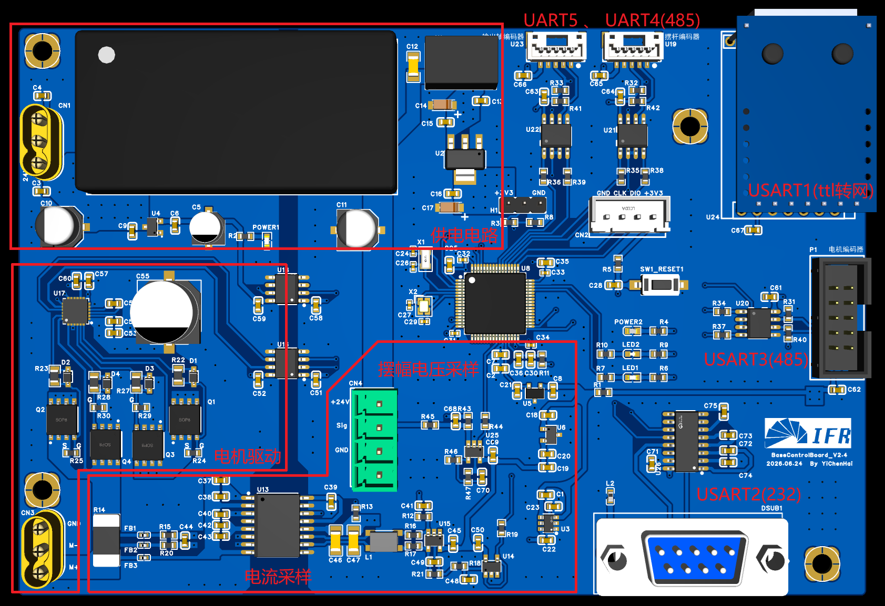
- 原理图
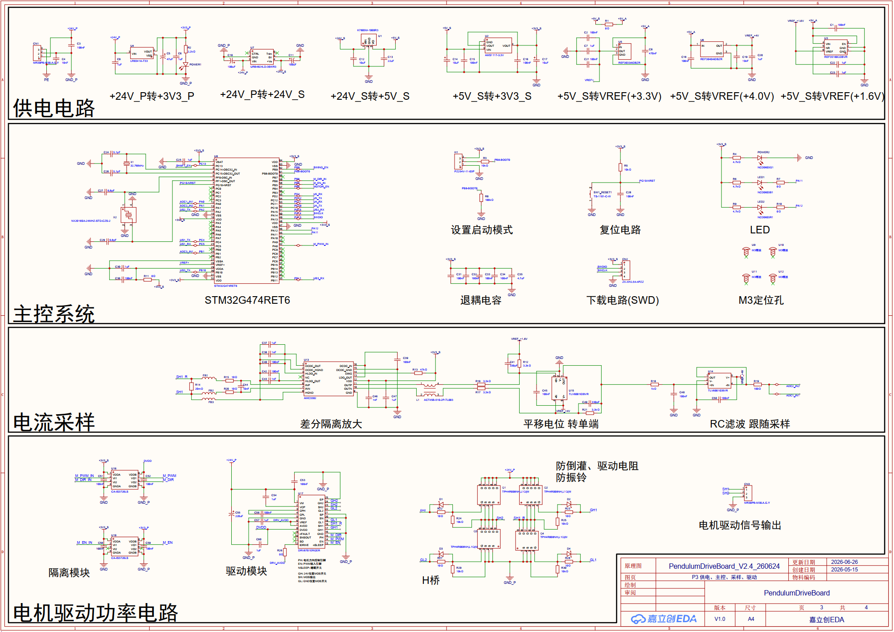
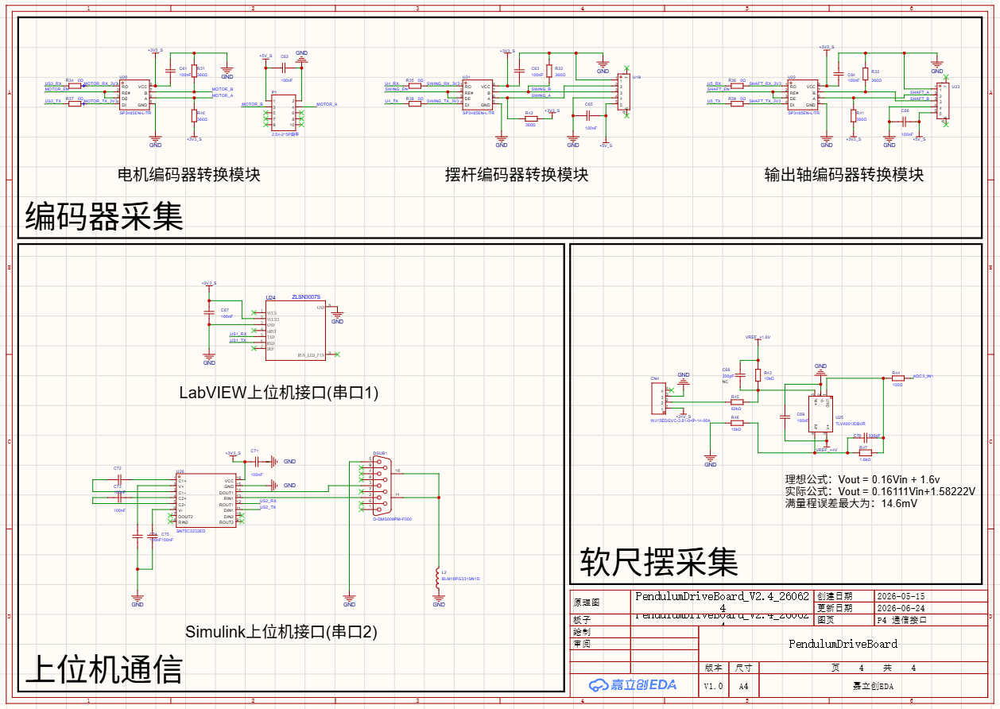

## 3.2  供电电路
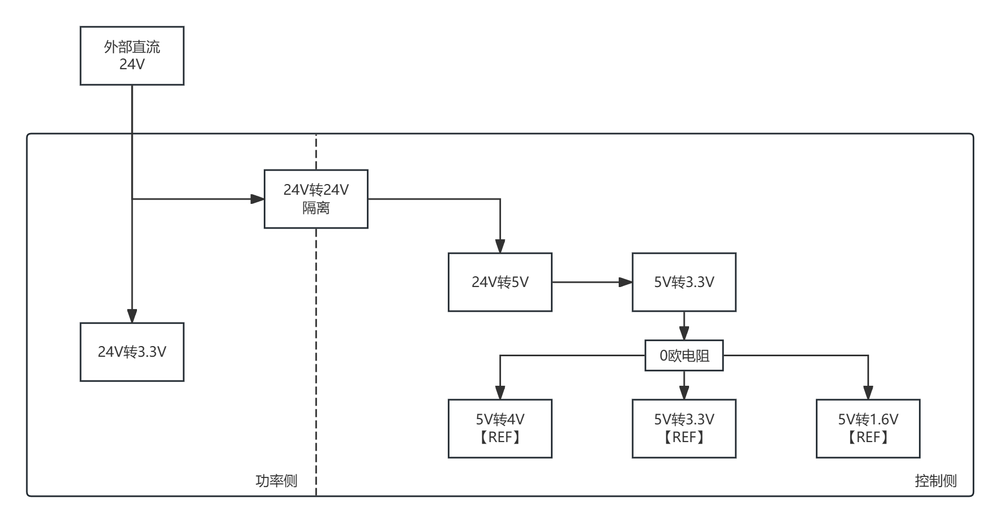
### 3.2.1  主要供电
本板供电按**功率域（P 域）与控制域（S 域）** 划分，功率域与控制域之间通过隔离型 DC-DC 与数字隔离器实现电气隔离，避免电机侧大电流、高 dv/dt 噪声耦合进敏感模拟/数字电路。

#### 3.2.1.1  外部输入与功率域（P 域）
- 外部电源输入：经 `CN1`（MR30 接口）接入，经电容滤波后作为板内 `+24V_P` 功率母线，作为整板能量来源。
- `+24V_P` 的用途：
    - 直接为外部 H 桥（`Q1～Q4，TPH4R008NH`）及 电机驱动芯片`DRV8701` 供电，驱动直流电机；
    - 经 `U4（LR8341A-T33）` 降压生成 `+3V3_P`，专供功率域侧数字隔离器 `U16/U18（CA-IS3720LS）` 副边工作；
    - 经隔离型 DC-DC 模块向控制域传递能量（见下文）。

#### 3.2.1.2  控制域（S 域）
控制域电源由隔离 DC-DC 从 `+24V_P` 侧获得 `+24V_S`，再逐级变换：

| 电源轨           | 产生方式                                   | 主要负载                                        |
| ------------- | -------------------------------------- | ------------------------------------------- |
| `+24V_S`      | 隔离 DC-DC（`+24V_P` → `+24V_S`）          | 控制域隔离电源母线                                   |
| `+5V_S`       | `U1（K7805M-1000R3）`，`+24V_S` → `+5V_S` | 三路 RS485 编码器接口（`U20/U21/U22` 的 VCC）         |
| `+3V3_S`      | `U2（AMS1117-3.3）`，`+5V_S` → `+3V3_S`   | `STM32G474`、RS485 收发器逻辑侧、隔离器主边、ZLSN3007S串转网 |
| `+5V_A`       | `+5V_S` 经 `R11（0Ω）` 馈入                 | 模拟参考电压产生电路（语义隔离，非电气隔离）                      |
| `VREF(+3.3V)` | `U5（REF3033AIDBZR）`                    | MCU `VREF+`                                 |
| `VREF_+4.0V`  | `U6（REF3040AIDBZR）`                    | 运放正电源                                       |
| `VREF_+1.6V`  | `U3（REF35160QDBVR）`                    | 电流采样偏置、摆幅调理偏置                               |

### 3.2.2  分区策略
#### 3.2.2.1  功率域与控制域
功率域与控制域在电源和控制信号上均做隔离：
- 电源隔离：`+24V_P` 与 `+24V_S` 由隔离型 DC-DC 分隔，两侧地（`GND_P` / `GND`）不直接相连。
- 信号隔离：`U16`、`U18（CA-IS3720LS，双通道/片）` 共 4 路隔离通道，承载 `M_PWM_IN→M_PWM`、`M_EN_IN→M_EN`、`M_DIR_IN→M_DIR` 三路电机控制信号。

电流采样链路中，`AMC3302（U13）` 自带隔离放大与集成 DC/DC，在功率域与控制域之间再次实现信号隔离，使电流反馈通道与功率地解耦。

#### 3.2.2.2  模拟地与数字地
>混合信号板优先用单一连续地平面 + 物理分区布线，而不是把模拟地和数字地彻底切开;
>分地风险大，分区优于分地；若必须跨分割，要有可控的回流路径（桥接/隔离/差分）。

本项目采用统一地平面设计，不对 `AGND` 和 `DGND` 进行分割。其主要原因在于：
- 单片机内部模拟模块与数字模块共享芯片衬底，外部分地无法实现完全隔离；
- 若分地处理不当，信号跨越地分区将导致回流路径中断，增加回流阻抗及地电位差，容易引入额外的噪声和电磁干扰。

因此，本项目采用统一接地策略，以合理的功能分区代替地平面分割。通过控制器件布局、优化走线、限制高速信号回流路径、加强局部去耦及电源滤波等措施，实现模拟电路与数字电路之间的有效隔离，使各功能区域的回流电流互不干扰，在满足模拟信号精度的同时，提高系统整体的稳定性和电磁兼容性能。

## 3.3  数字控制
### 3.3.1  主控选型
主控选用 `STM32G474RET6`，LQFP64 封装。相比旧方案中的 `STM32F407ZGT6`，虽然网口需要使用串口转网口来实现，但其支持高精度定时器，可以满足万分之一的PWM可调精度。同时G474具有5个串口，满足本项目对串口的需要(上位机通信2个、编码器通信3个)。

### 3.3.2  时钟与调试
- 主时钟：`NX2016SA-24MHz` ，提供 HSE；
- RTC 时钟：`32.768 kHz` 接 `OSC32_IN/OUT`；
- 调试接口：`CN2（4P 排针）` 引出 `SWDIO/SWCLK/GND/+3V3_S`；
- 复位：`SW1` 复位按键 + `NRST` 上拉；`BOOT0` 经 `R8（100k）` 下拉，默认从 Flash 启动。

### 3.3.3  通信接口分配
本板共需 5 路 UART，与 G474 五路 USART 一一对应：

| 用途           | 硬件路径                                      | 收发器/电平 | 使能控制       |
| ------------ | ----------------------------------------- | ------ | ---------- |
| 电机编码器        | `US3_TX/RX` → `U20（SP3485）` → `MOTOR_A/B` | RS485  | `MOTOR_EN` |
| 摆杆编码器        | `U4_TX/RX` → `U21（SP3485）` → `SWING_A/B`  | RS485  | `SWING_EN` |
| 轴/副编码器       | `U5_TX/RX` → `U22（SP3485）` → `SHAFT_A/B`  | RS485  | `SHAFT_EN` |
| Simulink 上位机 | `US2_TX/RX` → `U26（SN75C3232）` → `DSUB1`  | RS232  | —          |
| LabVIEW 上位机  | `US1_TX/RX` → `U24（ZLSN3007S）`            | 串转网    | —          |

RS485 总线侧各接 360Ω 终端/偏置电阻（`R31～R33、R40～R42`），`DE/RE#` 由 MCU GPIO 控制实现收发方向切换。

### 3.3.4  电机控制信号输出
MCU 经隔离器输出三路信号至 DRV8701：

| MCU 侧（S 域） | 隔离后（P 域） | DRV8701 引脚 | 功能      |
| ---------- | -------- | ---------- | ------- |
| `M_PWM_IN` | `M_PWM`  | `EN`       | PWM 占空比 |
| `M_EN_IN`  | `M_EN`   | `nSLEEP`   | 驱动使能    |
| `M_DIR_IN` | `M_DIR`  | `PH`       | 方向控制    |

上述信号走线经 `CA-IS3720LS` 隔离，副边由 `+3V3_P` 供电，主边由 `+3V3_S` 供电。

### 3.3.5  ADC 采样引脚

| 信号名        | MCU 引脚 | 用途             |
| ---------- | ------ | -------------- |
| `ADC1_IN1` | `PA0`  | 电机电流采样（高电平中心点） |
| `ADC2_IN2` | `PA1`  | 电机电流采样（低电平中心点） |
| `ADC3_IN1` | `PB1`  | 软尺摆幅电压         |

ADC 参考电压接 `VREF(+3.3V)`（`REF3033` 产生）。

## 3.4  电机驱动
### 3.4.1  驱动架构
电机驱动采用 "预驱 + 外置 H 桥" 拓扑：
- 栅极驱动器：`U17（DRV8701ERGER）` — TI 单 H 桥预驱芯片，PH/EN 控制模式；
- 功率开关：`Q1～Q4（TPH4R008NH N-MOSFET）` 组成全桥；
- 栅极电阻：`R22/R23/R27/R28（10 Ω）` 串入 GH/GL 走线，抑制振铃、限制峰值电流；
- 续流/钳位：`D1～D4` 提供电机换向时的续流路径；
- 储能电容：`C55（220 μF）` 等大电容就近 `VM` 与 `GND_P`，抑制母线纹波与负载突变。

DRV8701 引脚功能要点：
- `VM`：接 `+24V_P`；
- `DVDD/AVDD`：内部稳压，外围接退耦电容；
- `PH/EN/nSLEEP`：分别接隔离后的方向选择、PWM及使能控制；
- `GH1/GL1/GH2/GL2`：驱动四只 MOSFET 栅极；
- `SH1/SH2`：H 桥中点，接电机两端（`CN3` MR30 输出）。

### 3.4.2  栅极驱动强度
按 DRV8701 数据手册，支持如下六档电流档位：

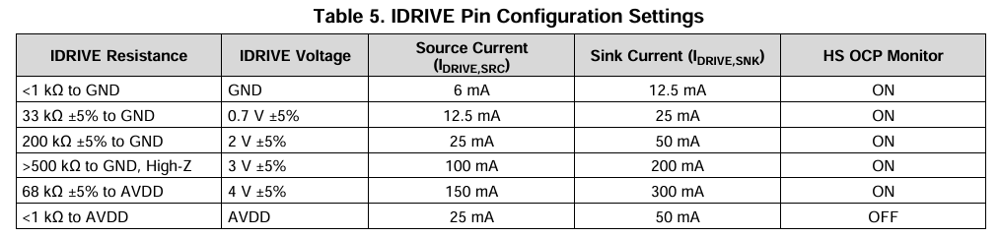

在本板上，可通过调整`R26` 连接 `AVDD`的方式，实现小于1kΩ、68kΩ、High-Z至`AVDD`三档。
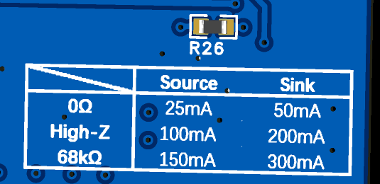

此外，协同栅极限流电阻调节 MOSFET 开通/关断斜率，在开关速度与波形完整性（含米勒平台阶段）之间折中。需注意：
- 更大 IDRIVE 电流 → 开关更快 → 米勒平台时间缩短，但 dv/dt 与振铃增大；
- 更小 IDRIVE 电流（本板当前配置）→ 开关更缓 → 米勒平台对有效占空比的影响时间更长，但波形更"钝"、EMI 更低。

### 3.4.3  死区时间
`DRV8701` 在硬件上实现约 150 ns 数字死区，并在模拟握手逻辑中防止上下管直通。观测到的总死区时间还包含 MOSFET 栅极充放电过程，与 IDRIVE 设定及外置 10 Ω 栅极电阻有关。
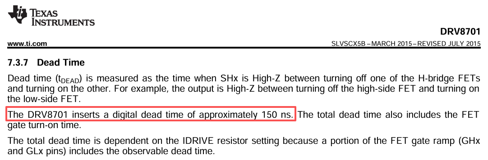
因此，软件侧无需再额外插入死区补偿即可满足一般直流电机驱动需求。


## 3.5  模拟采样
本板模拟采样分为两路：电机电流（隔离 + 偏置 + 滤波）与软尺摆幅电压（比例缩放 + 偏置）。两路均将双极性或浮动信号转换为 0～3.2 V 单极性范围，供 STM32 ADC 在 `VREF+=3.3 V` 下采样。

### 3.5.1  电机电流采样
- 电流采样电路如下图所示：
	- R14为20mΩ的采样电阻，与电机直接串联；
	- AMC3302为隔离差分放大，将采样电阻两侧的电压按固定增益41倍放大；
	- 经TLV6001运放，对采样放大后的电压加上+1.6V的偏置电压，使得电压范围转换至0~3.2V
	- 经过RC滤波电路，将平均电压送入跟随器，保障阻抗匹配，供单片机ADC采样。
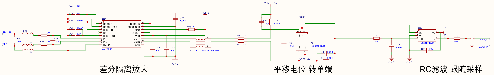

### 3.5.2  软尺摆幅电压采集
- 软尺摆幅电压采集电路如下图所示：
	- 输入电压范围为±10v；
	- 经运放电路，输入按公式转换:
$$
Vout = 0.16Vin + 1.6v
$$
转换后，输入ADC引脚电压范围为0~3.2v，供ADC采样。
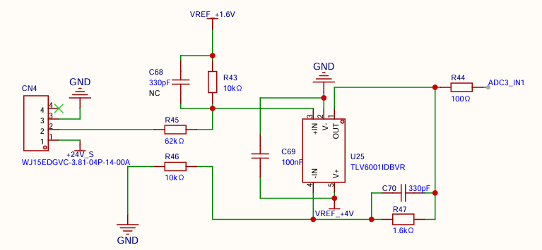


## 3.6  主控引脚功能速查表
- 上位机串口通信

| 软件外设 / 功能       | MCU 引脚 | CubeMX 信号名  | 硬件路径                         | 用途                |
| --------------- | ------ | ----------- | ---------------------------- | ----------------- |
| Simulink 上位机 TX | `PA2`  | `USART2_TX` | `SN75C3232` → `DSUB1`（RS232） | 反馈帧发送             |
| Simulink 上位机 RX | `PA15` | `USART2_RX` | 同上                           | 控制帧接收             |
| LabVIEW / 调试 TX | `PC4`  | `USART1_TX` | `ZLSN3007S`（串转网，规划中）         | 配置上位机 / 过渡期 DEBUG |
| LabVIEW / 调试 RX | `PC5`  | `USART1_RX` | 同上                           | 同上                |
- 编码器通信

| 软件外设 / 功能  | MCU 引脚 | CubeMX 信号名                   | 硬件路径                        | 用途           |
| ---------- | ------ | ---------------------------- | --------------------------- | ------------ |
| 电机编码器 TX   | `PB10` | `USART3_TX`                  | `U20（SP3485）` → `MOTOR_A/B` | RS485 绝对值编码器 |
| 电机编码器 RX   | `PB11` | `USART3_RX`                  | 同上                          | 同上           |
| 电机编码器收发使能  | `PB4`  | `Encoder_Motor_Enable`       | `U20` DE/RE#                | RS485 方向控制   |
| 摆杆编码器 TX   | `PC10` | `UART4_TX`                   | `U21（SP3485）` → `SWING_A/B` | RS485 绝对值编码器 |
| 摆杆编码器 RX   | `PC11` | `UART4_RX`                   | 同上                          | 同上           |
| 摆杆编码器收发使能  | `PB9`  | `Encoder_SwingArm_Enable`    | `U21` DE/RE#                | RS485 方向控制   |
| 输出轴编码器 TX  | `PC12` | `UART5_TX`                   | `U22（SP3485）` → `SHAFT_A/B` | RS485 绝对值编码器 |
| 输出轴编码器 RX  | `PD2`  | `UART5_RX`                   | 同上                          | 同上           |
| 输出轴编码器收发使能 | `PC13` | `Encoder_OutputShaft_Enable` | `U22` DE/RE#                | RS485 方向控制   |

- 电机控制

| 软件外设 / 功能 | MCU 引脚 | CubeMX 信号名              | 硬件路径                                     | 用途                          |
| --------- | ------ | ----------------------- | ---------------------------------------- | --------------------------- |
| 电机 PWM    | `PA8`  | `HRTIM1_CHA1`           | `M_PWM_IN` → `U16/U18` 隔离 → `DRV8701` EN | 占空比/速度给定，周期 50 µs（HRTIM 配置） |
| 电机使能      | `PB5`  | `MotorEnableControl`    | `M_EN_IN` → 隔离 → `DRV8701` nSLEEP        | 驱动开关                        |
| 电机方向      | `PB6`  | `MotorDirectionControl` | `M_DIR_IN` → 隔离 → `DRV8701` PH           | 正反转                         |

- 模拟量采样

| 软件外设 / 功能    | MCU 引脚 | CubeMX 信号名 | 硬件路径                  | 用途            |
| ------------ | ------ | ---------- | --------------------- | ------------- |
| 电机电流采样（通道 1） | `PA0`  | `ADC1_IN1` | 分流 + `AMC3302` + 偏置调理 | PWM 高/低电平中心采样 |
| 电机电流采样（通道 2） | `PA1`  | `ADC2_IN2` | 同上（冗余/双通道）            | 与 ADC1 同步双点采样 |
| 软尺摆幅采样       | `PB1`  | `ADC3_IN1` | ±10 V 比例缩放 + 偏置调理     | 软尺摆模式摆幅电压     |

- 最小系统

| 软件外设 / 功能 | MCU 引脚          | CubeMX 信号名                          | 硬件路径                          | 用途                                          |
| --------- | --------------- | ----------------------------------- | ----------------------------- | ------------------------------------------- |
| SWD 调试    | `PA13` / `PA14` | `SYS_JTMS-SWDIO` / `SYS_JTCK-SWCLK` | `CN2` 排针                      | 程序烧录与在线调试                                   |
| 主时钟 HSE   | `PF0` / `PF1`   | `RCC_OSC_IN` / `RCC_OSC_OUT`        | `NX2016SA-24MHz` 晶振           | 系统主时钟                                       |
| RTC 低速晶振  | `PC14` / `PC15` | `OSC32_IN` / `OSC32_OUT`            | 32.768 kHz 晶振                 | 当前固件未启用 LSE，引脚仅作硬件预留                        |
| 启动模式选择    | `PB8`           | `BOOT0`                             | `BOOT0` 经 `R8` 下拉，默认 Flash 启动 | 启动模式配置辅助                                    |
| 自定义LED    | `PA11` / `PA12` | `LED_BLUE` / `LED_RED`              | 经4.7kΩ电阻至3.3V_S               | 蓝色作为系统状态指示灯，初始化时常亮，运行时1s心跳翻转一次，红色上电直接拉高(熄灭) |


# 4  系统软件设计
## 4.1  软件分层架构设计
- 软件系统采用**自上向下**的**四层分层**架构：
	- **业务层**：
		- 位于系统最顶层，仅负责系统运行**流程的调度与管理**。
	- **服务层**：
		- **具有实际语义的功能模块**，包含有通信协议栈与控制算法；
		- 完成驱动层原始数据向业务数据的转换；
		- 对业务层提供统一的功能接口。
	- **驱动层**：
		- **屏蔽底层差异**，保证**原始数据**的**完整性**和**实时性**；
		- 不参与具体业务逻辑及协议解析；
		- 为服务层提供可靠的数据来源和硬件访问接口。
	- **HAL/寄存器层**：
		- 直接面向STM32硬件资源，由CubeMX生成的HAL库及必要的寄存器操作组成，负责UART、ADC、GPIO、HRTIM、DMA等外设的初始化与底层控制；
		- 为驱动层提供统一的硬件访问能力。
- 此外，系统采用**横向支持模块**对各层提供公共能力。
	- **BSP**：负责板级初始化及与具体硬件平台相关的支持功能；
	- **Common**：提供环形队列、CRC计算、字节序转换等通用组件；
	- **Config**：集中管理编译配置、功能开关及调试选项。


整个软件架构遵循**控制流自顶向下、数据流自底向上**的设计思想：业务层根据系统状态驱动各项功能执行，而底层硬件产生的数据依次经过驱动层的数据适配、服务层的业务处理，最终反馈至业务层完成系统决策，实现了业务逻辑与硬件平台的有效解耦，具有良好的模块化、可维护性及可扩展性。

## 4.2  文件存储结构
```
PendulumDriveFW/        # 工程根目录
│
├── readme.md                       # 版本与变更记录
│
├── User/                           # 用户手写代码（业务 + 服务 + 横向支撑）
│   │
│   ├── App/                        # 【业务层】主循环与状态调度
│   │
│   ├── Service/                    # 【服务层】通信协议与摆平台业务
│   │
│   ├── Bsp/                        # 【横向 BSP】板级系统能力
│   │
│   ├── Common/                     # 【横向公共库】纯软件工具
│   │
│   └── Config/                     # 【横向配置】工程选项配置
│
├── Core/                           # 【驱动层】CubeMX 生成 + 用户驱动
│
├── Drivers/                        # 【HAL 层】STM32 厂商库（勿改）
│   │
│   ├── CMSIS/
│   └── STM32G4xx_HAL_Driver/
│
└── MDK-ARM/                        # Keil μVision 工程与构建
```
- 各目录按软件分层划分：
	- `User/` 为全部手写业务逻辑与横向模块；
	- `Core/` 在 CubeMX 生成的外设初始化基础上扩展驱动接口；
	- `Drivers/` 为 ST 官方 HAL，一般不修改；
	- `MDK-ARM/` 为 Keil 工程与编译产物。
- 日常开发与阅读代码以 `User/`、`Core/` 为主，版本变更记录在根目录 `readme.md`。

## 4.3  软件运行流程
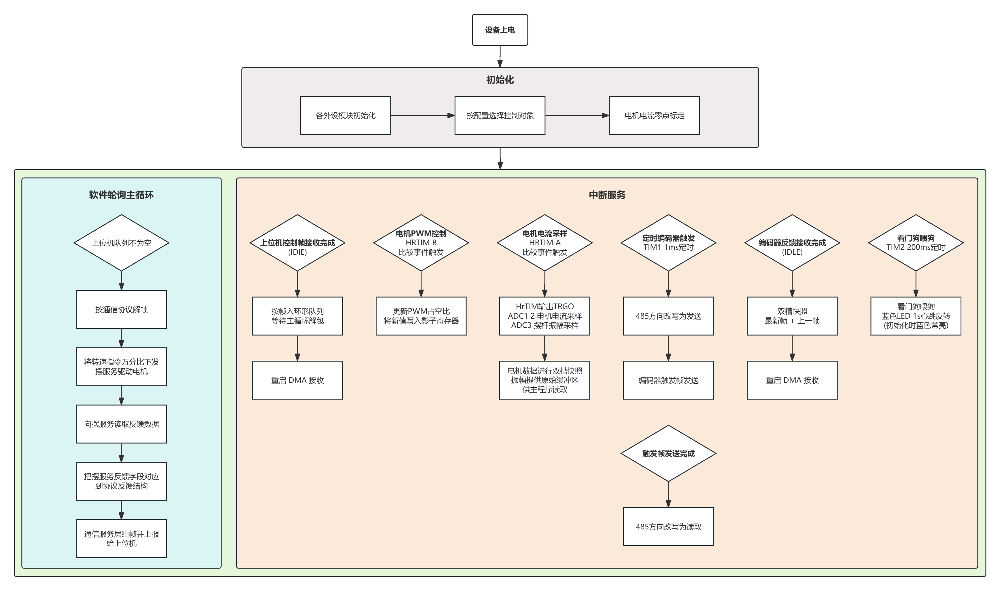
### 4.3.1  初始化阶段
设备上电后，依次完成：
1. **各外设模块初始化：**
	- GPIO、DMA、CRC、串口、ADC1/2/3、HRTIM、TIM1/TIM2、看门狗等；启动 HRTIM 输出、ADC DMA 采样、串口 DMA+空闲线接收、定时器中断。
2. **按配置选择控制对象：**
	- 倒立摆或软尺摆，决定反馈来源（编码器或 ADC3 摆幅电压）。
3. **电机电流零点标定：**
	- PWM 关闭、电机静止下采样并保存零点偏置。

### 4.3.2  软件轮询主循环
主循环按“有控制帧则处理一帧”的方式运行：
1. **检查上位机队列：**
	- USART2 收到完整控制帧后，由空闲中断写入环形队列；队列为空则继续轮询等待。
2. **按通信协议解析：**
	- 校验帧长、CRC、转速指令万分比范围（−10000 ~ +10000）等。
3. **下发转速指令：**
	- 将转速指令万分比交给摆服务，完成方向判定、占空比映射（拟合反推或直通），并写入 PWM 目标占空比。
4. **读取反馈数据：**
	- 从摆服务读取电机/输出轴/摆杆编码器快照、电机电流；软尺摆模式下摆幅来自 ADC3，倒立摆模式下摆杆仍来自编码器。
5. **字段映射：**
	- 将摆服务反馈结构拷贝到协议反馈结构（字段一一对应）。
6. **组帧上报：**
	- 通信服务层校验各字段范围、组 Simulink 反馈帧、经 USART2 DMA 发送给上位机。

### 4.3.3  中断服务(后台持续运行)
与主循环并行，按触发源分工如下：

| 触发源                       | 具体流程                                                                                       |
| ------------------------- | ------------------------------------------------------------------------------------------ |
| 上位机控制帧接收完成（USART2 空闲中断）   | 控制帧写入环形队列 → 重启 DMA 接收，等待主循环解包                                                              |
| 电机 PWM 控制（HRTIM B 比较事件）   | 若有待更新占空比 → 乘以 1.7 → 写入 HRTIM 比较寄存器（影子更新）→ 输出 PWM                                           |
| 电机电流采样（HRTIM A 比较事件）      | HRTIM 硬件 TRGO 触发 ADC1/ADC2 采样电机电流；ADC3 同步触发采样摆幅电压；TimerA 中断内将 ADC1/ADC2 打成双通道快照写入缓冲，供主循环读取 |
| 定时编码器触发（TIM1，1 ms 及周期内分相） | RS485 切发送 → 发送触发字节 0x02 → 触发帧发送完成后切回接收（三路编码器在 1 ms 周期内分相触发，避免同时收发）                         |
| 编码器反馈接收完成（UART3/4/5 空闲中断） | 应答组帧 → 写入双槽快照（最新帧 + 上一帧）→ 重启 DMA 接收，供主循环读位置/算转速                                            |
| 看门狗喂狗（TIM2，约 200 ms）      | 刷新独立看门狗，防止程序跑飞复位                                                                           |

## 4.4  软件层级模块设计
### 4.4.1  业务层
- 本层用于整个系统的运行调度，是整个系统的最顶层；
- 本层完全自行编写，存放于`User/App`。
- 结构为主循环轮询，协调各服务调用，是系统的「顶层调度」。
- 目前业务层只按固定顺序调用服务层，并在两层数据结构之间做字段映射。
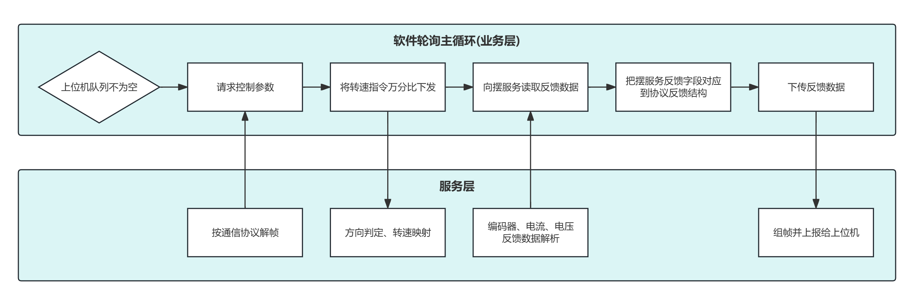
进入主循环后，反复执行以下步骤；上位机队列不为空且解帧成功，才继续后续处理。
1. **请求控制参数：**
	调用通信服务层按 Simulink 协议解帧，从 USART2 控制帧队列取出并解析控制量，得到转速指令万分比（−10000 ~ +10000）及电流设定等。当前工程仅使用转速指令，电流设定未参与调速。
2. **将转速指令万分比下发：**
	调用摆服务，将转速指令交给服务层完成方向判定、占空比映射、PWM 目标写入；业务层不参与具体算法与寄存器操作。
3. **向底层服务读取反馈数据：**
	调用摆服务汇总反馈，服务层内部完成**编码器、电流、电压（软尺摆模式下为摆幅电压）** 的读取与解析，填入摆反馈结构。
4. **把底层服务反馈字段对应到协议反馈结构：**
	业务层唯一自有的数据处理：将摆反馈结构中的电机电流、电机位置/转速、输出轴位置/转速、摆位置/转速七个字段，原样拷贝到协议反馈结构，使服务层与协议层互不直接依赖。
5. **下传反馈数据**
	调用通信服务层，对反馈字段做范围校验、组 Simulink 反馈帧、经 USART2 上报上位机。

### 4.4.2  服务层
- 本层用于编写具有实际语义的功能函数，服务于业务层；
- 本层完全自行编写；
- 本层目前包含两大模块，分别是**上位机通信模块**和**摆平台控制模块**。
#### 4.4.2.1  模块接口
- 服务层位于 User/Service，对上向业务层提供 Svc_* 接口，对下调用驱动层 Drv_\*；
- 负责协议解析、摆平台业务及驱动原始数据到业务数据的转换；
- 当前含 SimulinkProtocol、PendulumService 两个模块；LabVIEW 协议栈待开发，暂无对应接口。
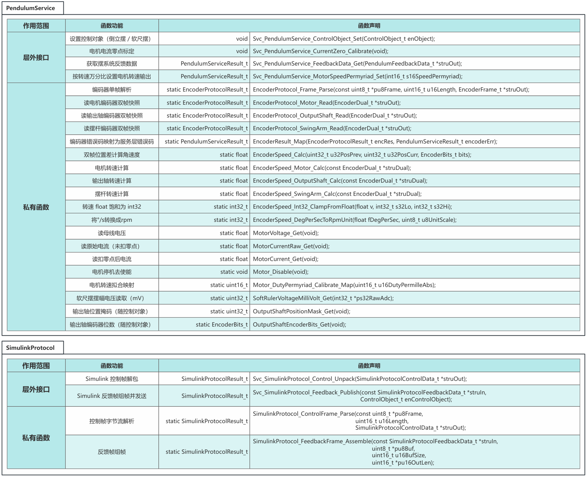
**SimulinkProtocol 模块:** 负责 Simulink 帧组解
层外接口两个：
- Svc_SimulinkProtocol_Control_Unpack 
	从 USART2 控制队列取帧，校验 CRC 与字段范围后输出转速万分比和电流设定；
- Svc_SimulinkProtocol_Feedback_Publish 
	校验反馈载荷量程、组帧并经 DMA 发送，软尺摆/倒立摆模式下对后两字段采用不同范围规则。

私有函数:
- ControlFrame_Parse、FeedbackFrame_Assemble 分别完成控制帧解包与反馈帧组帧，业务层不直接调用。

**PendulumService 模块:** 负责电机控制与状态反馈
层外接口四个：
- Svc_PendulumService_ControlObject_Set 
	设置控制对象（倒立摆/软尺摆，决定摆杆量来自编码器或 ADC3）；
- Svc_PendulumService_CurrentZero_Calibrate 
	上电静止时做电流零点标定；
- Svc_PendulumService_MotorSpeedPermyriad_Set 
	接收转速指令万分比，完成方向判定、死区处理、占空比映射后写 PWM 目标；
- Svc_PendulumService_FeedbackData_Get 汇总电机/输出轴/摆杆编码器、电流及软尺摆电压，填入 PendulumFeedbackData_t。

私有函数：
- 编码器单帧解析与三路双帧读取、解析错误映射；
- 基于相邻帧位置差计算各轴转速；
- 读取母线电压与电机电流（含零点扣除）；
- 占空比标定映射与电机关断；
- 软尺摆 ADC3 换算为 mV；
- 按控制对象选择输出轴位宽与掩码；
- 按编译选项，选择编码器速度反馈数据为°/s或rpm。

业务层典型调用顺序为：Control_Unpack → MotorSpeedPermyriad_Set → FeedbackData_Get → 字段映射 → Feedback_Publish；摆服务与 Simulink 协议通过数据结构字段对齐衔接，两层互不直接依赖。
#### 4.4.2.2  通信服务模块
- 此部分包含Simulink上位机协议栈和LabVIEW上位机协议栈；
- 由于LabVIEW上位机协议栈暂未定义，目前对应串口1仅用于DEBUG日志打印。
##### 4.4.2.2.1  Simulink上位机自定义协议栈
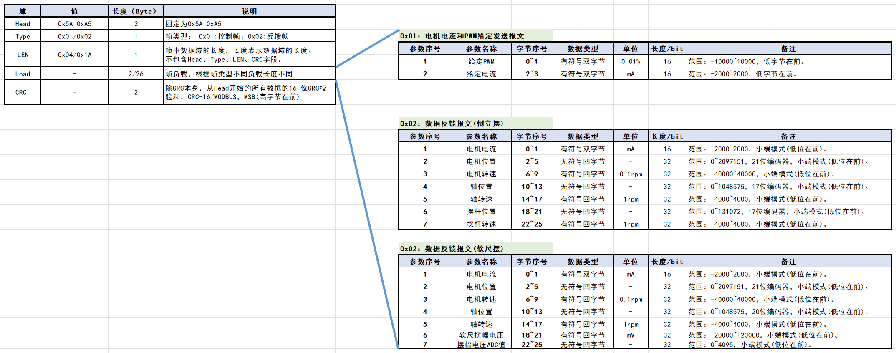
Simulink 协议栈经 USART2（921600）与 PC 端 Simulink 通信，采用应答模式：收一帧控制报文，回一帧反馈报文。实现位于 User/Service（simulink_protocol），底层收发由驱动层 Drv_Simulink_* 完成；业务层只调用两个接口——Control_Unpack 解控制帧，Feedback_Publish 校验、组帧并 DMA 发送反馈帧。

**帧格式统一为：**
帧头 0x5A 0xA5 + 类型 Type + 载荷长度 LEN + 载荷 Load + CRC16（MODBUS，覆盖帧头至载荷末，帧尾低字节在前）。

载荷区多字节均为小端序。控制帧 Type=0x01，总长 10 字节，载荷 4 字节：给定 PWM（int16，单位 0.01%，范围 ±10000，即 ±100.00% 占空比）和给定电流（int16，mA，±2000）。固件仅将 PWM 字段作为转速指令万分比下发摆服务，电流字段已解析校验但当前不参与调速。

反馈帧 Type=0x02，总长 32 字节，载荷 26 字节，前 5 项两种控制对象相同：电机电流、电机位置（21 位）、电机转速、轴位置、轴转速。

倒立摆模式下后两项为摆杆位置（17 位）和摆杆转速；软尺摆模式下后两项为软尺端电压（mV）和 ADC3 原始码（0~4095），轴位置按 20 位校验。组帧前协议层对各字段做量程检查，非法则拒绝发送。
##### 4.4.2.2.2  LabVIEW上位机自定义协议栈
**原定计划：**
USART1 原规划接入 LabVIEW 配置上位机，与 Simulink 控制上位机并列，职责侧重底板侧观测与配置。预期功能包括：
- 状态显示：周期性或按需上报底层运行信息，如电机电流/位置/转速、编码器解析状态、电流零点偏置、控制对象类型、关键 Config 开关状态等，供维护人员监视板卡是否正常。
- 参数配置：经 PC 侧下发指令，读写或触发底层配置项，如控制对象切换、PWM 映射模式、电流标定开关、调试选项等（与 `User/Config` 及摆服务相关能力对应），便于现场标定与故障排查而无需重新编译烧录。

**当前实现(过渡)：**
LabVIEW 协议栈与上位机程序尚未开发；USART1 在现阶段临时用作 DEBUG 调试口：
- 波特率 115200（与 USART2 的 921600 区分）；
- `printf` / `BSP_LOG_PRINTF` 经 BSP 重定向至 USART1，输出版本信息、联调日志及错误追踪；
- 驱动层已为 USART1 建立与 USART2 同构的 DMA + IDLE 收帧 + RFQ 入队 机制，但业务层与协议层未消费该队列，主循环不依赖 USART1；
- 开发期部分驱动自测（如 `Drv_PWM_TEST`）亦经 USART1 阻塞读入参数，属临时联调手段，非 LabVIEW 协议的一部分。

后续计划：LabVIEW 功能落地后，USART1 改回配置上位机专用；DEBUG 输出需迁移或通过 `DEBUG_PRINTF` 严格裁剪，避免与 LabVIEW 通信争用同一串口。§4.4.3.6 DMA 优先级中「LabVIEW USART1 RX/TX」命名即按此规划保留。
#### 4.4.2.3  摆系统服务模块
- 此部分主要分为电机控制和状态反馈两部分
	- 电机控制量为转速，由Simulink上位机发送的控制帧决定；
	- 反馈量根据控制对象：
		- 倒立摆：电机工作电流、电机位置、电机转速、输出轴位置、输出轴转速、**摆杆位置、摆杆速度。**
		- 软尺摆：电机工作电流、电机位置、电机转速、输出轴位置、输出轴转速、**软尺振幅电压值。**

对外接口反馈数据结构如下：
```c
typedef struct
{
    int16_t s16MotorCurrent;      /**< 电机电流，范围 -2000~2000 */
    int32_t s32MotorPosition;     /**< 电机位置，21 位编码器 */
	int32_t s32MotorSpeed; /**< 电机转速：见 FEEDBACK_SPEED_USE_RPM_FORMAT（°/s 或 0.1 rpm） */
	int32_t s32AxisPosition; /**< 输出轴位置：倒立摆 17 位 / 软尺摆 20 位 */
	int32_t s32AxisSpeed; /**< 输出轴转速：见 FEEDBACK_SPEED_USE_RPM_FORMAT（°/s 或 1 rpm） */
    int32_t s32PendulumPosition;  /**< 倒立摆: 摆位置(17 位编码器); 软尺摆: 摆动电压(mV) */
    int32_t s32PendulumSpeed;     /**< 倒立摆: 摆转速(同输出轴单位); 软尺摆: 预留(当前上报 ADC3 原始码) */
} PendulumFeedbackData_t;
```

##### 4.4.2.3.1  编码器通信协议解析
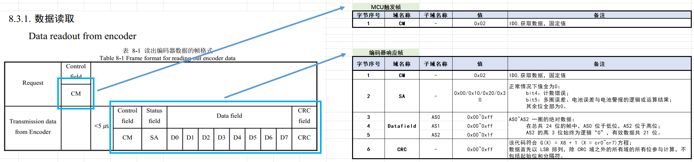

- 编码器仅支持问询-应答模式；主机需以 1ms 为周期发送一帧触发帧，以获取位置反馈。

- 响应帧由状态域、数据域和 CRC 校验域组成。软件处理顺序如下：
	1. CRC 校验：先对响应数据进行完整性校验；校验失败则返回对应错误信息。
	2. 状态域检查：校验通过后，检查状态域是否存在异常或报错；若存在异常则返回对应错误信息。
	3. 位置读取：上述检查均通过后，读取编码器绝对位置数据。
	处理过程中若任一步骤发生错误，均通过返回值回传具体报错信息。

##### 4.4.2.3.2  电机反馈
电机电流由 ADC1、ADC2 双通道采样，HRTIM 硬件触发，DMA 循环更新；由HRTIM A 比较中断中抓取 ADC 快照，服务层按需读取。

- **电机电流计算：**
	两路原始码取平均后转为电压，再按公式：
	$$电机电流 = (采样电压 − 偏置电压) ÷ 放大倍数 ÷ 采样电阻值$$
	带入当前电路具体值：
	$$电机电流 = (采样电压 − 1.6V) ÷ 41 ÷ 0.02 Ω$$
	扣除上电零点偏置后，乘以 1000 转为整数上报，并限幅在 −2000 ~ +2000。

- **上电标定流程：**
	关闭 PWM → 等待模拟前端电路稳定 → 丢弃前 16 次采样 → 再平均 64 次得到零点偏置。若偏置绝对值超过 ±1 A，则放弃本次标定，偏置置零。

##### 4.4.2.3.3  软尺摆幅电压反馈
仅在软尺摆模式下启用，由 ADC3 采样摆幅电压，HRTIM 触发、DMA 持续更新。

- **摆幅电压计算：**
	$$输入电压 = (采样电压 − 1.6 V) ÷ 0.16 $$
	再乘以 1000 得到摆动电压（mV），写入反馈结构中的摆位置字段；

- 同时将 ADC 原始码（0 ~ 4095） 写入摆转速字段，供上位机调试校验。

- 倒立摆模式下，上述两字段仍由摆臂编码器提供。

##### 4.4.2.3.4  电机控制
应用层收到 Simulink 控制帧后，将其中转速指令万分比下发至摆服务模块，由服务层完成方向判定、占空比映射和 PWM 输出。

该指令范围为 −10000 ~ +10000，对应 −100.00% ~ +100.00% 的目标占空比；正数表示正转，负数表示反转。

控制帧中的电流设定值当前不参与调速。

- **处理流程：**
	- 先校验指令是否在合法范围内；
	- 再与电路死区阈值 8（即 0.08%）比较——绝对值不超过 8 时关闭电机使能并将占空比置 0；
	- 有效指令则设置转向，取绝对值作为目标占空比，再经映射后交给驱动层。
	- 驱动层通过 HRTIM 输出 PWM，并用方向引脚、使能引脚控制电机转向与开关。

- **占空比映射可通过配置开关选择两种模式：**
	- 拟合反推模式（默认开启）下，上位机下发的是期望实际占空比，服务层依据标定表反推单片机应写入的 PWM 给定值；标定表采用分段线性插值，实际占空比上限按 95% 处理，零指令恒输出零；
	- 直通模式下，上位机给定值直接作为 PWM 输出，不使用标定表。

- **驱动层采用异步更新：**
	先保存目标占空比，在定时器中断中乘以 1.7 后写入硬件比较寄存器。占空比过低时不将比较器全部清零，而是保留占位值，以保证电流采样的硬件触发不中断。

执行结果通过返回值反馈：成功、参数非法（指令超范围）、驱动失败（占空比设置异常）。上电后须在 PWM 关闭、电机静止状态下完成电流零点标定，再进入正常调速。


### 4.4.3  驱动层
- 本层用于为上层屏蔽底层差异，读写各外设的基本数据，保证原始数据的完整上传；
- 本层由CubeMX生成外设初始化部分，自行编写对应外设的功能函数。

#### 4.4.3.1  模块接口
- 驱动层自编接口按 HRTIM、ADC、USART 三个外设模块组织，CubeMX 生成的 MX_* 初始化不在此列。
- 层外接口（Drv__）供服务层调用；层内接口（Drv_Loc__）供本层中断/回调使用；私有函数仅模块内部可见。
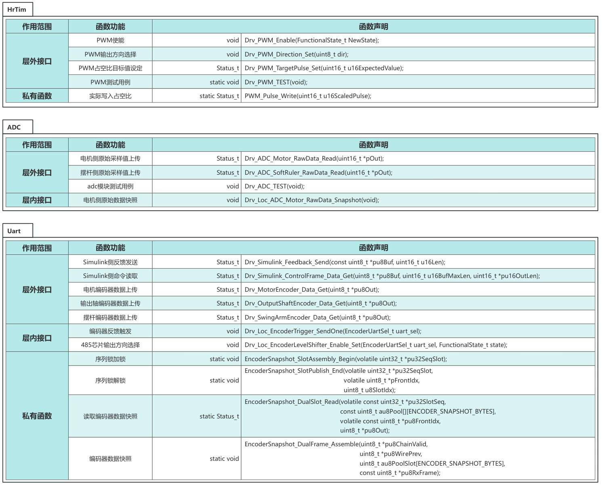
**HRTIM 模块:** 负责电机 PWM 输出
层外接口包括：
- Drv_PWM_Enable            控制使能；
- Drv_PWM_Direction_Set 设置正反转；
- Drv_PWM_TargetPulse_Set 
	写入目标占空比（仅置标志，实际写寄存器在 TimerB 比较中断中异步完成）；
- Drv_PWM_TEST 
	为开发期手动测占空比。
	
私有函数 
- PWM_Pulse_Write 
	将占空比折算后写入 HRTIM 比较寄存器，关断时保留占位值以维持 ADC 触发。

**ADC 模块:** 负责原始采样数据读取
层外接口：
- Drv_ADC_Motor_RawData_Read 
	读取电机电流 ADC1/ADC2 双通道快照（uint32 打包，保证读侧原子性）；
- Drv_ADC_SoftRuler_RawData_Read 
	读取软尺摆 ADC3 最新原始码；
- Drv_ADC_TEST 
	为开发期周期打印换算结果。

层内接口 
- Drv_Loc_ADC_Motor_RawData_Snapshot 
	在 HRTIM TimerA 比较中断中抓取双通道快照，服务层读接口只消费该快照，不再触发采样。

**USART 模块:** 负责 Simulink 通信与三路编码器数据
层外接口分两类：
Simulink 侧
- Drv_Simulink_ControlFrame_Data_Get 
	从 USART2 控制帧队列出队一帧；
- Drv_Simulink_Feedback_Send 
	经 DMA 发送反馈帧；
编码器侧
- Drv_ \* \_Data_Get
	分别读取电机/输出轴/摆杆编码器 12 字节双槽快照（最新 6 字节 + 上一帧 6 字节）。

层内接口：
- Drv_Loc_EncoderTrigger_SendOne 
	由 TIM1 分相发送 0x02 触发字节；
- Drv_Loc_EncoderLevelShifter_Enable_Set 
	控制 RS485 电平转换芯片收发方向。

私有函数
- EncoderSnapshot_SlotAssembly_Begin / SlotPublish_End 
	实现序列锁双槽发布；
- EncoderSnapshot_DualFrame_Assemble 
	在 IDLE 回调中组帧入槽；
- EncoderSnapshot_DualSlot_Read 
	供层外读接口做序列校验后拷贝快照。

整体上，服务层只通过 Drv_* 访问硬件；中断链路由 Drv_Loc_* 与私有函数完成数据采集与发布，上层无需关心 DMA、IDLE、序列锁等细节。


#### 4.4.3.2  回调与中断关系
- **编码器时序链：**
    TIM1 UEV (1ms)        →  PeriodElapsedCallback        →  触发 USART3 电机编码器
    TIM1 OC1 (+0.2ms)   →  OC_DelayElapsedCallback  →  触发 UART4 摆杆编码器
    TIM1 OC2 (+0.4ms)   →  OC_DelayElapsedCallback  →  触发 UART5 输出轴编码器
    编码器回帧                 →  RxEventCallback                  →  双槽快照入池

- **电机控制链：**
	上层 SetSpeed             →  仅写目标值 + 标志
	HRTIM TimerB CMP1  →  Compare1EventCallback  →  PWM_Pulse_Write 
	HRTIM TimerA CMP1  →  Compare1EventCallback  →  ADC 电流快照

- **通信链：**
	USART2 IDLE/TC     →  RxEventCallback     →   Simulink 控制帧入队
	USART2 发送           →  (DMA，无用户回调)

- **可靠性：**
	TIM2 UEV (~200ms)  → PeriodElapsedCallback   → IWDG 喂狗
	UART 错误                  → ErrorCallback                  → 重启 DMA 接收


#### 4.4.3.3  数据完整性保障方案
由于驱动层本地对数据进行上传时，如果数据字节数超过4字节，即数据拷贝的这个操作非原子操作，就有可能会被中断打断，从而改写内存数据，导致上传的数据不是来自同一个周期内，即原始数据被撕裂，因此需要对数据进行完整性保障。
##### 4.4.3.3.1  ADC数据
- 对于电机工作电流的采集，使用adc1和adc2在pwm波高电平中心和低电平中心点进行采集，单个adc数据为双字节采集，在HRTIM中断中对两个adc共四字节的数据进行数据打包为一个uint32类型的变量，在上层调用接口时，可以直接拷贝这个变量实现原子操作，保证数据完整性。
##### 4.4.3.3.2  编码器反馈
- **编码器反馈触发：**
	- 触发编码器反馈的周期为1000us；
	- 在Tim1的UEV + OC1 + OC2 三个 ISR 进行分相触发：向对应串口发送0x02触发电机编码器、摆杆编码器和输出轴编码器的数据反馈。
- **编码器数据接收：**
	- 每个编码器的数据长度固定为6字节，每次上层请求数据时，只关心缓冲中的最新两帧，因此使用双缓冲进行循环覆盖；
	- 在串口中断回调中进行数据接收，仅处理由TC(DMA搬运完成)和IDLE(串口空闲)两个标志位的回调请求；
	- 先对待发布的后台槽做序列锁加锁(序 +1 为奇)，把DMA缓冲区中最新6字节与上一帧6字节写入该槽，共12字节，再把当前DMA缓冲区数据拷入上一帧缓冲供下次用，最后解锁(序列值+1为偶数）并切换发布槽；最后重启 ReceiveToIdle_DMA。
	- 上层读编码器时，先读发布槽序列值：若为奇则重试(8次上限)，偶则拷贝发布槽12字节(最新 + 上一帧)，完成后再读一次序列值，与拷贝前相同则本次快照有效，不同则从头重试。

##### 4.4.3.3.3  上位机指令
- 上位机指令以固定周期发送，不同于编码器数据只保留最新帧，每一帧指令数据都应迅速进行响应，因此，使用循环缓冲区(数组+索引)，在中断回调函数中，对每帧数据进行入列操作，完成后再重启DMA接收，顶层状态机通过接口实时轮询队列状态，快速响应。

#### 4.4.3.4  ADC采集时序
- PWM波由HRTIM的TimerA比较通道1产生；
- 比较通道2和比较通道三用于产生trgo输出到ADC1、2、3用于触发采集；
- TimerB的比较通道1用于每偶数周期时，将新的PWM占空比写入影子寄存器。
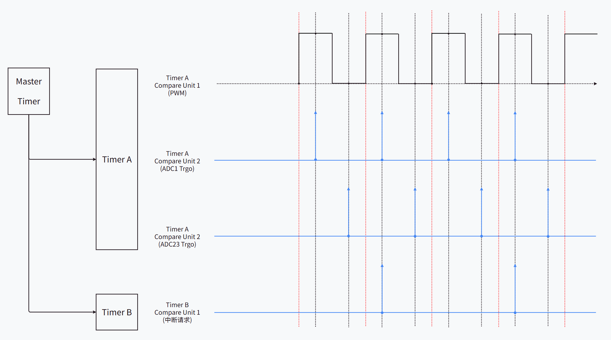


#### 4.4.3.5  中断优先级分组
-  **分组依据**
	- 优先保证物理实时性：精确时序控制信号 > 高速数据流 > 普通采集与调度信号
	- 精确时序控制信号:
		- 编码器 UART（USART3 / UART4 / UART5）【含TC 485方向切换】
		- TIM1（编码器定时触发）
		- HRTIM timerB更新PWM占空比
	- 高速数据流
		- HRTIM timerA电机电流采样数据快照
	- 普通采集与调度信号
		- 通信/调试 UART（USART1 / USART2）
		- TIM2（看门狗）
		- SysTick


0  编码器 UART（USART3 / UART4 / UART5）
1  TIM1（编码器定时触发）
2  HRTIM TimerB（电机 PWM）
3  HRTIM TimerA（电流数据快照）
4  通信/调试 UART（USART1 / USART2）
5  编码器 DMA
6  USART1/2 收发 DMA
7  ADC1/2/3 DMA 
8  TIM2（看门狗）
15 SysTick（最低）


| 优先级 | 对象                               | 说明                                                                                                                                                           |
| --- | -------------------------------- | ------------------------------------------------------------------------------------------------------------------------------------------------------------ |
| 0   | 编码器 UART（USART3 / UART4 / UART5） | 2.5 Mbps RS485 半双工；IDLE/TC 回调组帧写 12 字节双槽快照；USART3/4/5 发送完成（TC）中断将 DE 切回接收。业务在 UART 中断内完成，须高于 Simulink 通信链。                                                   |
| 1   | TIM1（编码器定时触发）                    | 1 ms 周期 UEV（`TIM1_UP`）触发 USART3 电机编码器；OC1 ≈+0.20 ms（Pulse=1999）触发 UART4 摆杆；OC2 ≈+0.40 ms（Pulse=3999）触发 UART5 输出轴。保障 1000 µs 节拍与错相，ISR 宜极短（发 0x02、RS485 切发送）。 |
| 2   | HRTIM TimerB（电机 PWM）             | CMP1（0x5302）比较中断：若有待更新占空比标志，则 ×1.7 后写入 TimerA 比较寄存器（影子更新）。仅主循环下发新目标时执行，ISR 宜短。                                                                               |
| 3   | HRTIM TimerA（电流数据快照）             | CMP1 比较中断内调用 `Drv_Loc_ADC_Motor_RawData_Snapshot`，将 ADC1/2 DMA 缓冲打包为 uint32 快照；ADC 实际采样由 TimerA CMP2/CMP3 硬件 TRGO 触发，不依赖本中断发采样。                              |
| 4   | 通信/调试 UART（USART1 / USART2）      | USART2：921600，Simulink 控制帧入队 / 反馈帧 DMA 发送；USART1：115200，DEBUG/LabVIEW 预留。ms 级通信，低于编码器与 HRTIM 实时链。                                                            |
| 5   | 编码器 DMA                          | DMA2 Ch1/2/3 对应 UART3/4/5 RX，硬件搬移应答字节；配合 IDLE 收帧，中断主要为 HAL 状态维护。                                                                                             |
| 6   | USART1/2 收发 DMA                  | DMA1 Ch3/4/6/8 等；USART2 TX 完成须恢复 HAL 发送状态，否则反馈帧可能 `HAL_BUSY`。                                                                                                |
| 7   | ADC1/2/3 DMA                     | DMA1 Ch1/2/5 等，循环写采样缓冲；电流在 TimerA 快照中读取，主循环读反馈。                                                                                                              |
| 8   | TIM2（看门狗）                        | 约 200 ms 周期（PSC=1699、ARR=19999）在 UEV 回调中刷新 IWDG（超时约 512 ms），容错大，优先级低。                                                                                        |
| 15  | SysTick（最低）                      | 系统时基（如 `HAL_GetTick`），最低优先级，避免影响实时外设。                                                                                                                        |

#### 4.4.3.6  DMA优先级分组
- VERY_HIGH  
	- 编码器 UART RX  (USART3、UART4、UART5)
- HIGH            
	- 上位机 UART RX  (LabVIEW USART1 RX、Simulink USART2 RX)
- MEDIUM      
	- ADC1、ADC2、ADC3
- LOW             
	- 上位机 UART TX (LabVIEW USART1 TX、USART2 TX)


### 4.4.4  HAL/寄存器层
- 本层直接操作外设寄存器，为最底层的实际执行层；
- 本层完全由CubeMX生成，为HAL库本身。

### 4.4.5  BSP 模块
- 本模块为**横向板级支持包**，可供驱动层、服务层、业务层调用；
- 本模块完全自行编写，存放于 `User/Bsp`；
- 封装与具体板卡/芯片相关、但不宜散落在各服务中的系统级能力，使上层无需直接依赖 HAL 类型即可使用延时、Tick、调试输出与硬件 CRC 等公共功能。

#### 4.4.5.1  模块职责
BSP 模块目前主要承担以下四类工作：

|类别|说明|主要使用者|
|---|---|---|
|板级初始化|按固定顺序调用各外设 MX 初始化，并启动 HRTIM 输出与时基|`main` 入口，上电调用一次|
|系统服务|毫秒级阻塞延时、系统 Tick 读取|标定流程、自测循环、服务层延时|
|硬件 CRC16|片内 CRC 外设计算 MODBUS CRC16|Simulink 协议组帧/解帧|
|调试输出|`printf` 重定向至调试串口；提供可裁剪日志宏|各层联调与错误追踪|

#### 4.4.5.2  板级初始化
`Bsp_Init` 在 `HAL_Init()` 与系统时钟配置完成后、进入主循环前调用一次，依次完成 GPIO、DMA、CRC、串口、ADC、HRTIM、TIM1/TIM2、看门狗等外设初始化。

HRTIM 启动顺序有严格要求：先使能 TimerA/TimerB 波形输出，再启动带中断的从定时器计数，最后启动 Master 定时器作为同步基准，以保证首个 PWM 周期起 PWM 边沿、ADC 触发与比较中断相位对齐。

#### 4.4.5.3  调试输出
调试信息经 USART1（115200）输出，与 Simulink 通信口 USART2 隔离。

- `BSP_LOG_PRINTF`：
	- 受 Config 模块 `DEBUG_PRINTF` 控制；关闭时编译期删除，主循环/中断内可零开销保留调用点。
- `BSP_LOG_PRINTF_FORCE`：
	- 不受开关约束，用于上电强制打印软件版本、控制对象名称及编译日期。
- `printf` / `fputc`：
	- 重定向至 `DEBUG_UART_HANDLE` 指定的调试串口，供上面两种打印调用。

#### 4.4.5.4  硬件 CRC16
Simulink 控制帧与反馈帧的 CRC16 校验统一经 `Bsp_Crc16Modbus_Calc` 完成，使用片内 CRC 外设（须与 CubeMX 中 CRC 初始化配置一致：标准 MODBUS CRC16，多项式 0x8005、初值 0xFFFF）。

函数内部对 CRC 外设做短临界区保护，避免与中断上下文并发访问；参数非法或长度为 0 时返回 0。


### 4.4.6  Common 模块
- 本模块为**横向公共库**，存放跨层复用的纯软件工具与通用类型；
- 本模块完全自行编写，存放于 `User/Common`；
- 零 HAL/外设依赖（仅依赖标准整型头文件），不参与具体业务语义。

#### 4.4.6.1  通用类型

Common 模块定义全工程共用的基础枚举与状态类型：
```c
typedef enum 
{ 
	PRJ_DISABLE = 0U, 
	PRJ_ENABLE = 1U 
} FunctionalState_t;

typedef enum 
{ 
	STATUS_OK, 
	STATUS_ERROR, 
	STATUS_BUSY, 
	STATUS_TIMEOUT 
} Status_t;

typedef enum 
{
	CONTROL_OBJECT_INVERTED_PENDULUM = 0U, /* 倒立摆 */
	CONTROL_OBJECT_SOFT_RULER_PENDULUM /* 软尺摆 */
} ControlObject_t;

```
- `FunctionalState_t`：项目内统一的使能/失能语义，与 HAL 功能状态一致，供 PWM 使能等接口使用。
- `Status_t`：通用操作结果，取值与 HAL 状态码对齐，便于驱动层返回值映射。
- `ControlObject_t`：运行期控制对象选择，由业务层写入摆服务，影响摆杆反馈来源。

#### 4.4.6.2  帧级环形队列（RFQ）
为解决上位机控制帧「每帧均需响应、不可只保留最新帧」的需求，Common 提供帧级环形队列：
- 单生产者（串口 IDLE 中断入队）、单消费者（主循环出队）；
- 单帧最大 10 字节，队列深度 8 槽（有效容量 7 帧）；
- 无动态内存分配，入队时整帧拷贝，出队失败或队列满时返回 `STATUS_ERROR`。

典型用法：驱动层 USART2 空闲中断收到完整控制帧后调用入队；Simulink 协议解帧时出队。USART1 调试口亦初始化独立 RFQ，供 LabVIEW 协议预留。

#### 4.4.6.3  小端序打包/解包
Simulink 协议载荷字段均为小端序多字节整数，Common 提供 `Cmn_Int16LE_Pack/Unpack` 与 `Cmn_Int32LE_Pack/Unpack`，供协议层组帧、解帧统一使用，避免各模块自行移位拼接。

#### 4.4.6.4  CRC 软件算法

|函数|算法|工程中的用法|
|---|---|---|
|`Cmn_CRC8_Calc`|多项式 x⁸+1，初值 0x00|编码器应答帧（CM/SA/AS）尾校验，摆服务解析时调用|
|`Cmn_CRC16Modbus_Calc`|MODBUS CRC16 软件实现|与 BSP 硬件 CRC 数学等价；保留作对照或离线验证，协议路径实际走硬件 CRC|

### 4.4.7  Config 模块
- 本模块为**横向配置模块**，全工程用户开关的唯一集中入口；
- 本模块仅含头文件 `User/Config/Inc/config.h`，无 `.c` 实现，零外设依赖；
- 将原先分散在 BSP、服务层、应用层的编译选项、功能开关与调试开关统一收拢，便于裁剪、对比不同构建变体及版本管理。

各模块通过 `#include "config.h"` 引用所需选项，不在各自头文件中重复定义，避免配置漂移。

Config 模块按以下三类组织：

#### 4.4.7.1  编译选项（Compile）
决定条件编译走向，影响最终生成的代码路径。

| 宏名称                           | 当前默认值   | 含义                    |
| ----------------------------- | ------- | --------------------- |
| `VERSION_NUM_STR`             | `"2.0"` | 软件版本字符串，上电 banner 打印  |
| `APP_CONTROL_OBJECT_SELECT`   | 倒立摆     | 编译期选择控制对象：倒立摆 / 软尺摆   |
| `APP_CONTROL_OBJECT_NAME_STR` | 随上项自动推导 | 控制对象英文名称，上电 banner 打印 |

业务层据 `APP_CONTROL_OBJECT_SELECT` 选择反馈分支（摆杆来自编码器或 ADC3 摆幅电压）；非法配置在编译期 `#error` 报错。

#### 4.4.7.2  功能选项（Feature）
控制运行期功能分支，不改变工程目录结构。

| 宏名称                               | 当前默认值 | 含义                                                                                                                                                                             |
| --------------------------------- | ----- | ------------------------------------------------------------------------------------------------------------------------------------------------------------------------------ |
| `MOTOR_CURRENT_ZERO_CALIB_ENABLE` | 1     | 1：反馈电流扣除上电零点偏置；0：上报原始电流                                                                                                                                                        |
| `MOTOR_PWM_USE_FIT_MAPPING`       | 1     | 1：拟合反推占空比（默认）；0：直通映射                                                                                                                                                           |
| `FEEDBACK_SPEED_USE_RPM_FORMAT`   | 1     | **反馈速度单位选择（Simulink 反馈帧，编译期）**<br>• `0`：电机 / 输出轴 / 倒立摆摆杆速度以 **°/s** 上报（int32；协议校验电机 ±40000，轴/摆 ±4000）<br>• `1`：**当前默认**；电机 **0.1 rpm** 刻度（±66667），输出轴与倒立摆摆杆 **1 rpm** 刻度（±667） |
上述开关由摆服务模块在编译期或运行期读取，用于电流标定与 PWM 映射以及反馈单位策略切换，无需修改业务层流程。

#### 4.4.7.3  调试选项（Debug）
仅用于开发、联调与驱动自测，发布前宜收敛。

| 宏名称                  | 当前默认值    | 含义                                             |
| -------------------- | -------- | ---------------------------------------------- |
| `DEBUG_PRINTF`       | 0        | 调试日志总开关，驱动 `BSP_LOG_PRINTF`                    |
| `DEBUG_UART_HANDLE`  | `huart1` | 调试 printf 重定向串口句柄                              |
| `DEBUG_UART_TIMEOUT` | 1000 ms  | 调试串口阻塞发送超时                                     |
| `TEST_DRV`           | 0        | 0：正常应用主循环；1：进入驱动自测死循环                          |
| `TEST_ADC`           | 0        | 仅在 `TEST_DRV=1` 时有效：周期调用 ADC 自测                |
| `TEST_PWM`           | 0        | 仅在 `TEST_DRV=1` 时有效：自测循环内调用 `Drv_PWM_TEST()`自测 |

`main` 中对 `TEST_ADC` 、`TEST_PWM` 与 `TEST_DRV` 做组合合法性校验：`TEST_ADC=1` 或`TEST_PWM` 时必须 `TEST_DRV=1`，否则编译报错。


# 5  可测试性设计
本工程在软件分层与 Config 集中配置基础上，通过编译期开关、分层入口隔离、统一返回值、调试观测口与内置校验等手段，支持驱动联调、模块验证及整板回归，且发布版可关闭调试路径以减小开销。

## 5.1  配置化测试入口
工程在 `User/Config/Inc/config.h` 中集中定义测试与调试开关，按「编译选项 → 功能选项 → 调试选项」分区管理，便于构建不同测试变体而不改动业务逻辑：

| 开关                                | 作用                                   | 典型测试场景                                                                        |
| --------------------------------- | ------------------------------------ | ----------------------------------------------------------------------------- |
| `APP_CONTROL_OBJECT_SELECT`       | 编译期选择倒立摆 / 软尺摆                       | 同一固件工程验证两种控制对象反馈分支                                                            |
| `MOTOR_CURRENT_ZERO_CALIB_ENABLE` | 开/关电流零点扣除                            | 对比标定前后电流反馈，排查上电异常偏置                                                           |
| `MOTOR_PWM_USE_FIT_MAPPING`       | 拟合反推 / 直通两种 PWM 映射                   | 标定表有效性验证、死区补偿对比                                                               |
| `FEEDBACK_SPEED_USE_RPM_FORMAT`   | Simulink 反馈帧速度单位：`0`=°/s，`1`=rpm（默认） | 与 Simulink 上位机量纲对齐；切换后对比同一物理转速下的整型反馈值及协议校验范围（电机 ±40000/±66667，轴/摆 ±4000/±667） |
| `DEBUG_PRINTF`                    | 调试日志总开关                              | 联调期打开；发布版置 0，日志宏零开销                                                           |
| `TEST_DRV`                        | 驱动自测总开关                              | 1：跳过应用主循环，进入驱动层自测                                                             |
| `TEST_ADC`                        | ADC 驱动周期自测（须 `TEST_DRV=1`）           | 周期打印 ADC 原始值与换算结果                                                             |
| `TEST_PWM`                        | PWM 驱动手动自测（须 `TEST_DRV=1`）           | 经 USART1 输入占空比，验证 HRTIM 输出与占空比更新链                                             |

`main.c` 在编译期对 `TEST_ADC`、`TEST_PWM` 与 `TEST_DRV` 做组合合法性校验：`TEST_ADC=1` 或 `TEST_PWM=1` 时均须 `TEST_DRV=1`，否则编译报错，避免误配导致自测代码永不执行。

自测模式下仍完成 `Bsp_Init()` 与外设启动，但不进入业务主循环（不调用 `App_StateMachine_MainLoop()`），看门狗仍由 TIM2 中断刷新，保证长时间联调不死机。

上电后通过 `BSP_LOG_PRINTF_FORCE` 强制输出软件版本、控制对象名称及编译时间，便于确认当前烧录镜像与测试配置是否一致。

## 5.2  分层隔离与驱动自测
软件四层架构本身利于自底向上验证：驱动层可独立于业务层运行。`TEST_DRV=1` 时，`main` 进入自测死循环，按开关选择性调用下列用例：

### 5.2.1  ADC 自测（`Drv_ADC_TEST`）
- 启用条件：`TEST_DRV=1` 且 `TEST_ADC=1`。
- 调用方式：自测循环内每 500 ms 调用一次。
- 测试内容：
	- 经驱动读接口 `Drv_ADC_Motor_RawData_Read` 取电机 ADC1/ADC2 中断快照（uint32 打包，与 HRTIM TimerA CMP1 中断内 `Drv_Loc_ADC_Motor_RawData_Snapshot` 对齐）；
	- 经 `Drv_ADC_SoftRuler_RawData_Read` 取软尺摆 ADC3 DMA 缓冲最新原始码。
	- 换算与输出：按 §4.4.2.3 公式换算采样电压及理论量——电机侧理论电流：`(Vadc − 1.6) ÷ 41 ÷ 0.02`（A）；摆杆侧理论输入电压：`(Vadc − 1.6) ÷ 0.16`（V）。经调试串口打印原始码、电压与理论值；读失败时打印 `[ADC_TEST]` 错误标签，便于定位快照或 DMA 链路问题。
	- 观测依赖：输出经 `BSP_LOG_PRINTF`，须 `DEBUG_PRINTF=1`。
- 典型场景：验证 HRTIM 触发 ADC、DMA 循环采样及电流快照打包链路；PWM 变更后配合观察理论电流是否随占空比变化。

### 5.2.2  PWM 自测（`Drv_PWM_TEST`）
- 启用条件：`TEST_DRV=1` 且 `TEST_PWM=1`。
- 调用方式：自测循环内周期调用；函数内部阻塞等待 USART1 输入，无固定周期（与 ADC 自测不同）。
- 测试内容：
	- 经 USART1（`DEBUG_UART_HANDLE`，115200）读入 5 位 ASCII 数字（`00000`～`10000`，单位 0.01%，对应 0.00%～100.00% 目标占空比），解析后写入与 `Drv_PWM_TargetPulse_Set` 同源的目标占空比变量并置更新标志；
	- 实际装载至 HRTIM 比较寄存器在 HRTIM TimerB CMP1 比较中断中异步完成（×1.7 折算后影子更新），与正常运行路径一致。
- 操作步骤：
    1. 配置 `TEST_DRV=1`、`TEST_PWM=1`，建议 `DEBUG_PRINTF=1`；
    2. 连接 USART1 调试口；
    3. 上电确认 `BSP_LOG_PRINTF_FORCE` 版本 banner；
    4. 按提示输入 5 位占空比（如 `05000` 表示 50.00%）；
    5. 示波器观测 PWM 输出，或同时开启 `TEST_ADC=1` 观察电流采样是否随占空比变化。
- 输入约定：须恰好 5 位数字，前导零不可省略（如 `00008` 表示 0.08%）；函数入口先预读调试口缓冲最多 10 字节（100 ms 超时），降低上电残留字符干扰；读入失败则循环等待直至收到 5 字节。
- 范围与边界：占空比语义与 `Drv_PWM_TargetPulse_Set` 一致（0～10000）；过低占空比时驱动层保留占位比较值以维持 ADC 外触发（§4.4.3.4），关断时不将比较器全部清零。
- 局限说明：本用例不调用 `Drv_PWM_Enable` / `Drv_PWM_Direction_Set`，仅验证占空比写入与 HRTIM 更新链；H 桥使能、正反转须人工拉引脚或临时在测试函数内补充，方可带动电机。
- 日志依赖：输入提示经 `BSP_LOG_PRINTF` 输出，须 `DEBUG_PRINTF=1`；关闭时仍可经串口发 5 位数字完成设值，但无文字提示。


# 6  遗留问题
- LabVIEW 配置上位机（USART1）：协议栈与 PC 端程序尚未开发。USART1 原规划用于底层状态监视与参数配置，现阶段临时作 DEBUG 口（115200）；实现后须恢复为 LabVIEW 专用通道，DEBUG 输出合并进入LabVIEW日志协议，避免与配置通信争用。驱动层 RFQ、DMA 接收框架已预留。

- 控制对象切换方式：倒立摆/软尺摆目前仅能通过 `APP_CONTROL_OBJECT_SELECT` 编译期选择，运行期无法切换；若 LabVIEW 上位机落地，应加入控制对象切换功能。

- Simulink 控制帧电流设定：协议已解析「给定电流」字段并做范围校验，当前固件未参与调速或限流，仅使用 PWM（转速万分比）字段；后续若需电流环或限幅保护，需补充服务层策略并与上位机模型对齐。
   
- 异常处理与诊断：`Error_Handler` 仅作最小化停机打印，未区分 HAL 错误类型，也未记录至非易失存储；现场故障定位仍主要依赖 DEBUG 串口，后续应在LabVIEW上位机显示报警，可配合板载红色LED进行双重报警。